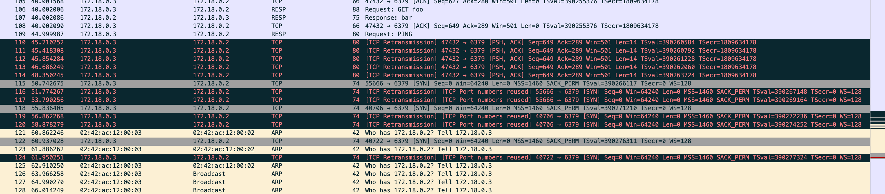

A note on  redis client library testing to simulate network failure. Just to formalize a brain dump.

All tests were done using Lettuce [sample client](./testlettuce).

## Testing 

| Method                                                       | Comments                                                     | Usage              |
| :----------------------------------------------------------- | :----------------------------------------------------------- | :------------------ |
| Halt machine using [halt](https://man7.org/linux/man-pages/man8/halt.8.html) --halt -f command | Halt a machine <br> On Ubuntu the `halt --halt`  TCP stack  sends a `FIN` packet hence is similar to kill process. <br>  [test_halt_machine.pcap](./test_halt_machine.pcap) <br><br> Where as ` halt --halt -f`  does **not** send a  FIN packet and is appropriate for testing. <br>  [test_halt_force.pcap](./test_halt_force.pcap)  | use halt --halt -f |
| Kill Redis process (kill -9)                                 | OS will clean resources and  underlying TCP stack   will send  FIN to close connection. Hence does not mimic hard failover<br>  [test_kill_redis_process.pcap](./test_kill_redis_process.pcap)  | No                 |
| Firewall                                                     | Stop all network traffic using [firewall script](./fail.sh)  e.g. <br>  `iptables -t filter -A OUTPUT -j DROP` <br> `iptables -t filter -A INPUT -j DROP` <br>As any new packets are dropped , quite similar to pulling a network cable. <br> [test_firewall_block.pcap](./test_firewall_block.pcap)  | Yes                |
| Docker pause                                                 | `docker pause`  command freezes the processes in the container cgroup, the connections are not dropped , the packets are  buffered and  `sync` packet is sent back to client connection. Client will timeout as no data is received. Once containter is **unpaused** the buffered packets are delivered.<br>  [test_docker_pause.pcap](./test_docker_pause.pcap) <br>  | No                 |
| Docker network disconnect                                    | Connections will fail with  timeout underlying error is   `no route to host'. After disconnect when I tried to connect in RS the container never joined the cluster. With OSS worked as expected. <br>  [test_docker_network_disconnect.pcap](./test_docker_network_disconnect.pcap) <br> | Yes                |


## Appendix

### Client Lib Behaviour on Timeout

1. Connection pool and discard connection on timeout (Jedis, py-redis).  Connection timeout (connection and socket timeout)  settings are enough, TCP_KEEPALIVE might be required for long live idle connections see  14 

   TCP Keep alive can be set at OS level(not ideal ) or at connection/socket level https://github.com/redis/jedis/issues/26

```
echo 10 > /proc/sys/net/ipv4/tcp_keepalive_time
echo 2 > /proc/sys/net/ipv4/tcp_keepalive_intvl
echo 2 > /proc/sys/net/ipv4/tcp_keepalive_probes
```


2. Libraries that multiplex over single connection( Lettuce, StackExchange.Redis) do not retry new  connection on timeout. You need to setup TCP_KEEP_ALIVE and also retransmisson retires [TCP_USER_TIMEOUT](https://tools.ietf.org/html/rfc5482) at socket level or [net.ipv4.tcp_retries2](https://man7.org/linux/man-pages/man7/tcp.7.html) at OS level for proper failover.

   [Connection resilience](https://learn.microsoft.com/en-gb/azure/azure-cache-for-redis/cache-best-practices-connection)

   [When TCP sockets refuse to die](https://blog.cloudflare.com/when-tcp-sockets-refuse-to-die/)

   https://github.com/lettuce-io/lettuce-core/issues/2082 

### Tools Used
* Docker on Ubuntu 18.04.5 LTS in a GCP machine

* To run RS in Docker https://github.com/redislabs-training/dockerized-redis-enterprise.git

* nsenter to montior connections  run by processes in docker

  ```
  nsenter -t  6663  -n tcpdump -vvv -A -w testfail2.pcap
  nsenter -t  27679 -n netstat -c -town
  ```


### TCP Connection Life Cycle

```

September 1981
                                           Transmission Control Protocol
                                                Functional Specification


                              +---------+ ---------\      active OPEN
                              |  CLOSED |            \    -----------
                              +---------+<---------\   \   create TCB
                                |     ^              \   \  snd SYN
                   passive OPEN |     |   CLOSE        \   \
                   ------------ |     | ----------       \   \
                    create TCB  |     | delete TCB         \   \
                                V     |                      \   \
                              +---------+            CLOSE    |    \
                              |  LISTEN |          ---------- |     |
                              +---------+          delete TCB |     |
                   rcv SYN      |     |     SEND              |     |
                  -----------   |     |    -------            |     V
 +---------+      snd SYN,ACK  /       \   snd SYN          +---------+
 |         |<-----------------           ------------------>|         |
 |   SYN   |                    rcv SYN                     |   SYN   |
 |   RCVD  |<-----------------------------------------------|   SENT  |
 |         |                    snd ACK                     |         |
 |         |------------------           -------------------|         |
 +---------+   rcv ACK of SYN  \       /  rcv SYN,ACK       +---------+
   |           --------------   |     |   -----------
   |                  x         |     |     snd ACK
   |                            V     V
   |  CLOSE                   +---------+
   | -------                  |  ESTAB  |
   | snd FIN                  +---------+
   |                   CLOSE    |     |    rcv FIN
   V                  -------   |     |    -------
 +---------+          snd FIN  /       \   snd ACK          +---------+
 |  FIN    |<-----------------           ------------------>|  CLOSE  |
 | WAIT-1  |------------------                              |   WAIT  |
 +---------+          rcv FIN  \                            +---------+
   | rcv ACK of FIN   -------   |                            CLOSE  |
   | --------------   snd ACK   |                           ------- |
   V        x                   V                           snd FIN V
 +---------+                  +---------+                   +---------+
 |FINWAIT-2|                  | CLOSING |                   | LAST-ACK|
 +---------+                  +---------+                   +---------+
   |                rcv ACK of FIN |                 rcv ACK of FIN |
   |  rcv FIN       -------------- |    Timeout=2MSL -------------- |
   |  -------              x       V    ------------        x       V
    \ snd ACK                 +---------+delete TCB         +---------+
     ------------------------>|TIME WAIT|------------------>| CLOSED  |
                              +---------+                   +---------+

                      TCP Connection State Diagram
                               Figure 6.
```

